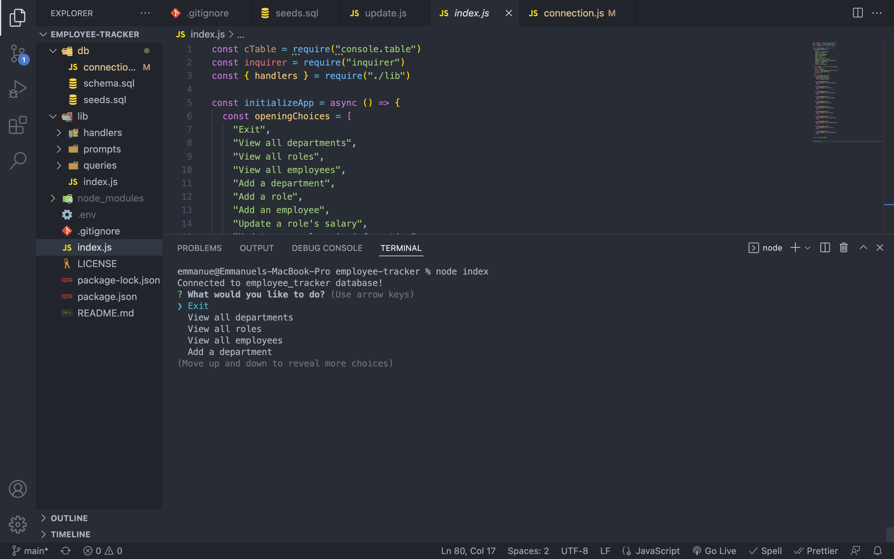

# Employee-Tracker

## Description 

Command line application that can track employees of a company. Can add departments, roles, employees with salaries, and managers with salaries. 

## Built With: 

* Node.Js
* Javascript

## Usage 

Clone the code and install npm packages on your local machine. 

## Link to video demo

[https://youtu.be/L9z8S5IVkLo](https://youtu.be/L9z8S5IVkLo)
